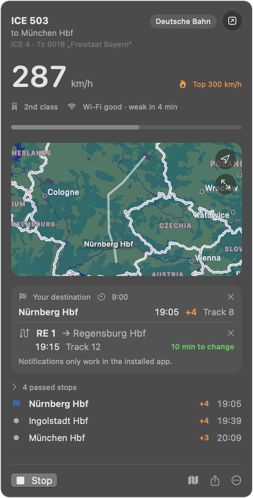
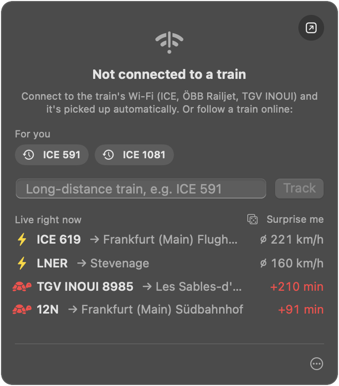
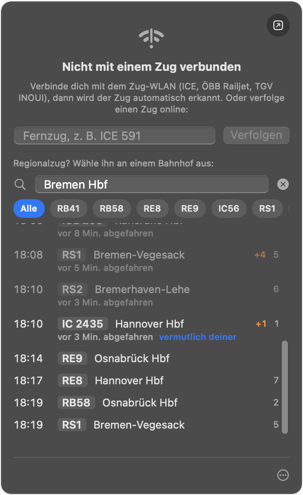

# Zugbar

Live train info in your Mac's menu bar: speed, next stop, delays, tracks, map and route, straight from the
train's Wi-Fi (DB ICE, ÖBB Railjet, SNCF TGV INOUI). Set a destination and connection to get notified about
delays, track changes and tight transfers. Off the train, follow any train online via
[Transitous](https://transitous.org). English and German.

<table>
  <tr>
    <td valign="top"></td>
    <td valign="top"></td>
    <td valign="top"></td>
  </tr>
</table>

> [!NOTE]
> Vibe-coded hobby project, mostly written by Claude and built on
> [TrainStatusInfo](https://github.com/niklaswa/TrainStatusInfo), [onboardapis](https://github.com/felix-zenk/onboardapis),
> [ICE-Buddy](https://github.com/ICE-Buddy) and [Transitous](https://transitous.org). The portals are unofficial
> APIs. Not affiliated with DB, ÖBB or SNCF.

## Install

Download the [latest release](https://github.com/zuranihenry/zugbar/releases/latest) and move `Zugbar.app` to
`/Applications` (macOS 14+). It isn't notarized; allow it under *System Settings → Privacy & Security*, or:

```bash
xattr -dr com.apple.quarantine /Applications/Zugbar.app
```

Or build it: `make install`.

## Development

```bash
make demo
make test
swift run Zugbar --lookup "ICE 591"
```

Portals live in `Sources/ZugbarCore/Providers/`. Settings → Debug can trigger every notification and simulate
delays on the demo train.

[MIT](LICENSE) · [Third-party notices](THIRD_PARTY_NOTICES.md)
